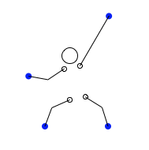

# climber
A simple climbing simulator in racket

In its very early state.

It is controlled using a dual-analog stick joystick. Currently mapping only works for dualshock 4 on Os X.

## Installation
The following libraries need to be installed

- [racket-posn](https://docs.racket-lang.org/posn/index.html)
- [racket-csfml](https://github.com/massung/racket-csfml) (requires csfml 2.5, the debian version seems to be broken, install from source)
- [lens](https://docs.racket-lang.org/lens/index.html)
- [threading](https://docs.racket-lang.org/threading/index.html?q=threading)
